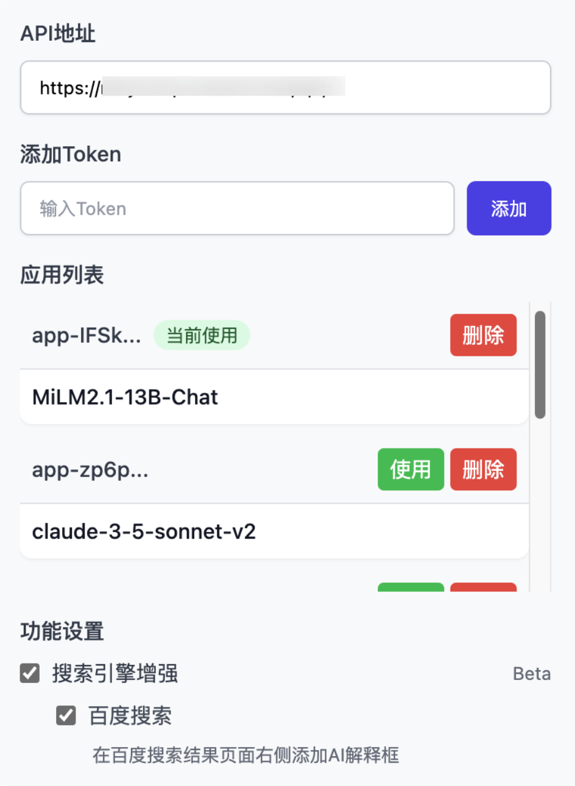

# DifyHelper - AI 助手浏览器扩展

> 🤖 特别说明：本项目（包括此 README）完全由 AI 生成，使用 Cursor + Claude 3.5 完成。向 AI 技术致敬！

DifyHelper 是一个强大的浏览器扩展，它可以帮助用户在浏览网页时快速获取 AI 的智能解答。通过与 Dify.ai 平台的无缝集成，为用户提供即时的智能问答和搜索增强服务。

## ✨ 主要功能

### 1. 智能问答
- 选中任意文本，即可唤起 AI 助手
- 支持多轮对话
- 实时流式响应
- 可随时终止输出
- 支持快捷操作（解释、总结、翻译等）

### 2. 搜索增强
- 在百度搜索结果页自动展示 AI 解释
- 智能分析搜索关键词
- 提供相关背景知识
- 实时更新搜索结果解释

### 3. 灵活配置
- 支持多个 Dify 应用切换
- 可自定义 API 地址
- 功能模块独立开关
- 界面简洁直观

## 🌟 特色亮点

1. **实时响应**
   - 采用流式输出
   - 支持随时终止生成
   - 响应速度快

2. **智能交互**
   - 优雅的浮动按钮
   - 简洁的对话界面
   - 人性化的操作设计

3. **稳定可靠**
   - 完善的错误处理
   - 智能的重试机制
   - 可靠的状态管理

4. **高度定制**
   - 多应用切换
   - 功能模块配置
   - 界面布局优化

## 🛠️ 技术特点

- 原生 JavaScript 开发，无需框架依赖
- 模块化设计，代码结构清晰
- 优秀的异常处理机制
- 完善的日志记录系统
- 智能的 DOM 监听和处理
- 可靠的状态管理方案

## 🎯 使用场景

1. **阅读理解**
   - 快速理解复杂文本
   - 获取专业术语解释
   - 深入分析文章内容

2. **搜索辅助**
   - 增强搜索结果理解
   - 提供额外背景信息
   - 快速获取知识要点

3. **学习研究**
   - 辅助文献阅读
   - 加深概念理解
   - 提高学习效率

## 📝 开发说明

本项目采用纯原生技术栈开发，主要包含以下文件：

- `content.js`: 内容脚本，处理页面交互
- `popup.html/js`: 弹出窗口界面及逻辑
- `search_enhance.js`: 搜索增强功能模块
- `background.js`: 后台服务脚本
- `manifest.json`: 扩展配置文件

## 🚀 未来展望

1. 支持更多搜索引擎
2. 添加更多快捷操作
3. 优化交互体验
4. 提供更多定制选项
5. 支持更多 AI 平台

## 🌐 兼容性

- Chrome 88+
- Edge 88+
- Firefox 78+
- Safari 14+